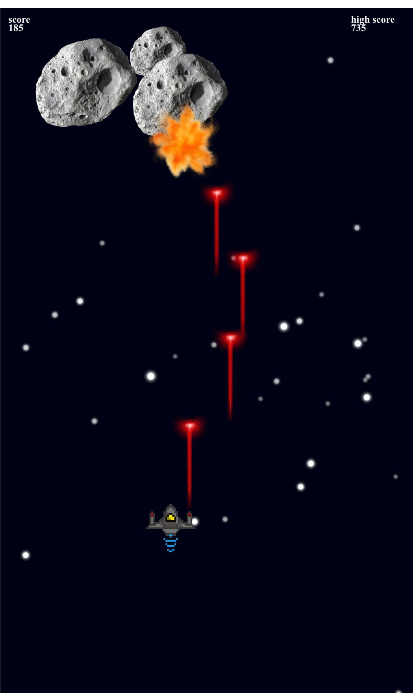

```
# Space Shooter

## Overview

Space Shooter is a 2D web game created using Phaser. The player controls a spaceship and must destroy incoming asteroids to survive and score points. The goal is to achieve a high score and avoid colliding with the asteroids.

## Features

*   Spaceship control: touch and Mouse support
*   Automatic laser firing
*   Asteroids with random sizes and health
*   Collision detection between lasers and asteroids
*   Asteroids get smaller when hit and destroyed
*   Game over state when the spaceship is hit by an asteroid
*   Scoring system
*   Responsive design for different screen sizes

## Technologies Used

*   Phaser 3
*   JavaScript
*   HTML
*   CSS

## How to Play

1.  Download or clone the game repository.
2.  Open `index.html` in your web browser.
3.  Control the spaceship using touch (on mobile) or mouse (on desktop).
4.  Avoid asteroids and shoot them down with lasers.
5.  Survive as long as possible and achieve a high score!


## Install / Use

*   Install serve: `npm install -g serve`
*   Run: serve .

## Game Screenshot



```